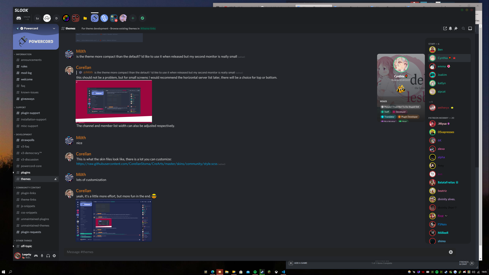

## SLOOK THEME V2
A Discord Theme Focused On Your Messages.

## INFO

Slook Theme primary goal is to make you focus on your chats while looking stylish :)
So Enjoy!
- Any Issues DM Leeprky#2063

## V2 

V2 Came Around due to it now being the final version with some bug fixes along the way & possibly new features.
It now using index.css to import real-time so no more git pulling
And Very few bugs now are in the theme

Hope You Enjoy! - Any Issues DM Leeprky#2063

## How To Install SLOOK V2.0

> Head to C:\Users\[USER]\powercord\src\Powercord

> Right Click "themes" and click Git Bash Here

> Type "git clone https://github.com/leeprky/slook-theme"

> Refresh Discord

## License

MIT, see LICENSE.md for more details

## Previews

## MY OTHER THEMES

Also 

https://github.com/leeprky/cybercordtheme-yellow
- 
&
https://github.com/leeprky/cybercordtheme-cyan

## OR
https://github.com/leeprky/cybercordtheme-transparent

