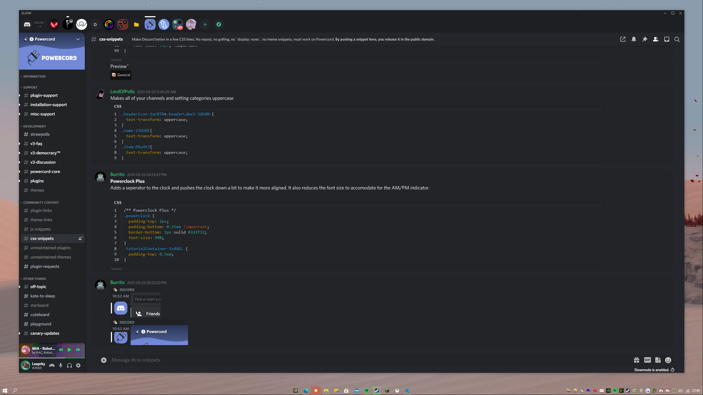
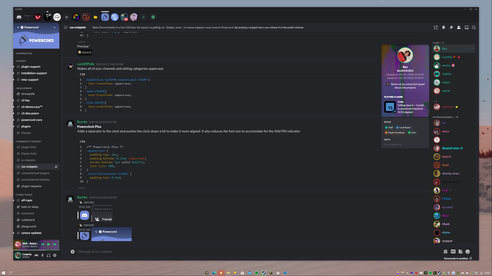
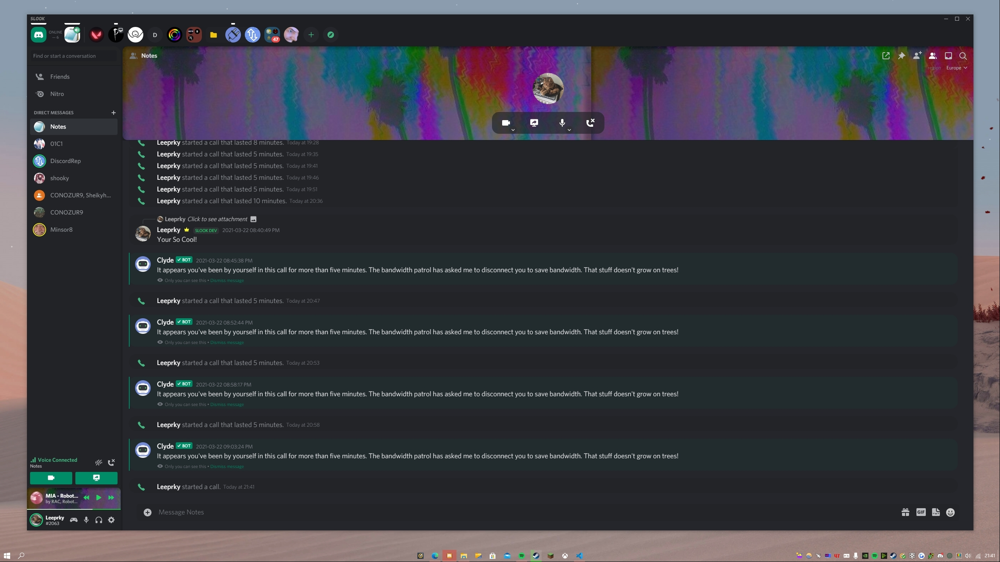
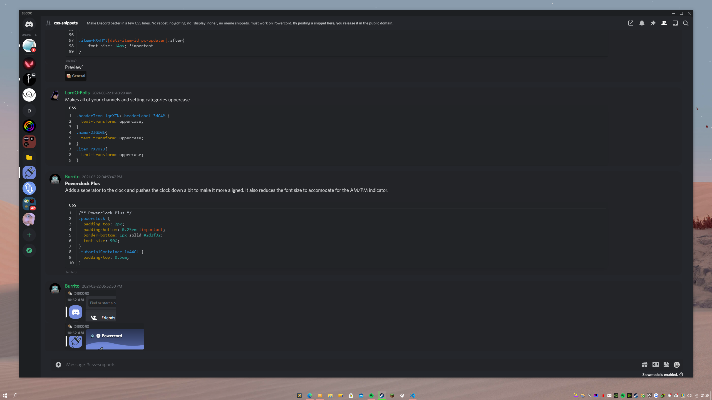
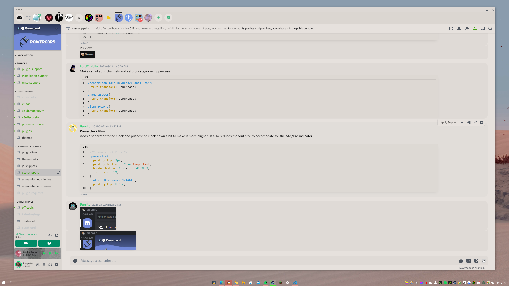
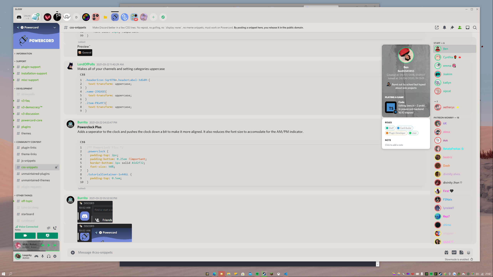
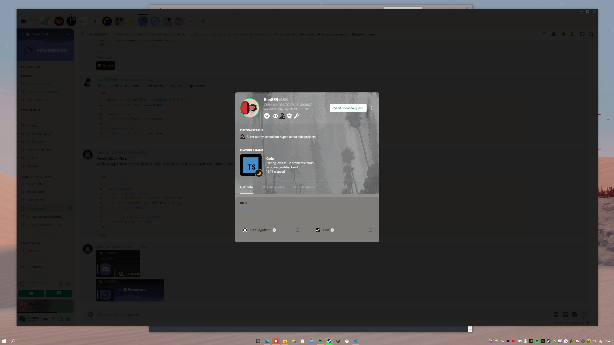
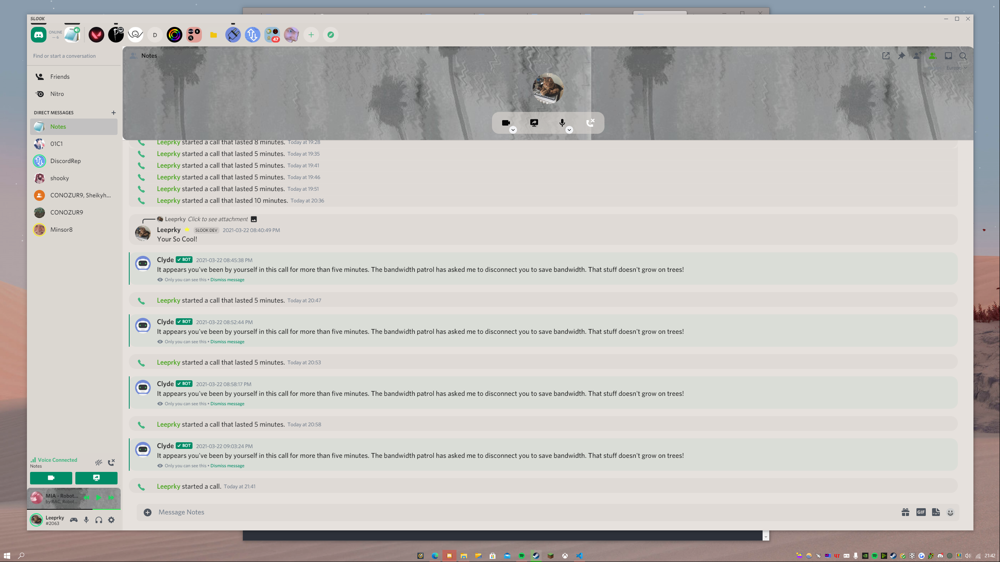
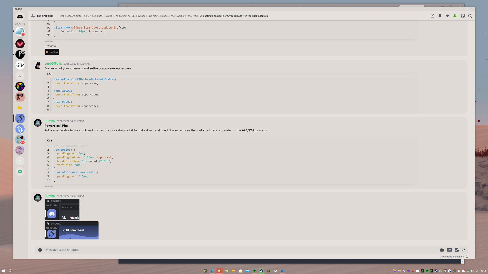

## SLOOK THEME V1.13.1
A Discord Theme Focused On Your Messages.

## INFO

Slook Theme primary goal is to make you focus on your chats while looking stylish :)
So Enjoy!
- Any Issues open up one or DM Leeprky#2063

If You Wish To Use The Popout ChannelList Please go to line "500" And Remove it
*Make Sure Horizontal Server List Is OFF If Installed*

If You Wish To Use The OSX Windows Bar Please go to line "425* And Remove it.
*Windows Only*

If you wish to use Glasscord With This Theme Please go to line "19" And Remove It.
*Must Have Glasscord* - "https://github.com/AryToNeX/Glasscord"

## How To Install SLOOK V1.13.1

> Head to C:\Users\[USER]\powercord\src\Powercord

> Right Click "themes" and click Git Bash Here

> Type "git clone https://github.com/leeprky/slook-theme"

> Refresh Discord

## License

MIT, see LICENSE.md for more details

## Previews

## No ChannelList

## Light Mode

## No ChannelList

## MY OTHER THEMES

Also 

https://github.com/leeprky/cybercordtheme-yellow
- 
&
https://github.com/leeprky/cybercordtheme-cyan

## OR
https://github.com/leeprky/cybercordtheme-transparent

